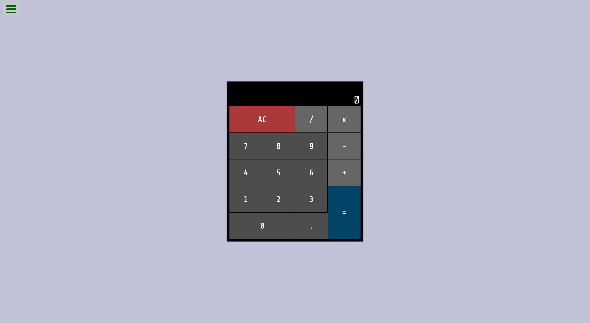

# freeCodeCamp - Build a Drum Machine

This is a solution to the [Build a Javascript Calculator challenge](https://www.freecodecamp.org/learn/front-end-development-libraries/front-end-development-libraries-projects/build-a-javascript-calculator) on freeCodeCamp.

## Table of contents

- [Overview](#overview)
  - [The challenge](#the-challenge)
  - [Screenshot](#screenshot)
  - [Links](#links)
- [My process](#my-process)
  - [Built with](#built-with)
  - [What I learned](#what-i-learned)
  - [Continued development](#continued-development)
  - [Useful resources](#useful-resources)
- [Author](#author)

## Overview

### The challenge

Users should be able to:

- View the optimal layout for the site depending on their device's screen size

### Screenshot

<table>
  <tr>
    <td>
      
    </td>
  </tr>
  <tr>
    <td>
      
    </td>
  </tr>
</table>

### Links

- Live Site URL: [here](https://zun-liang.github.io/fcc-javascript-calculator/)

## My process

### Built with

- HTML
- CSS
- Flexbox
- Mobile-first workflow
- [React](https://reactjs.org/) - JS library
- [Styled Components](https://styled-components.com/) - For styles
- [Vite](https://vitejs.dev/)

### What I learned

-

### Continued development

-

### Helpful Resources

- [vertical-align: text-top](https://developer.mozilla.org/en-US/docs/Web/CSS/vertical-align)

## Author

- Website - [Zun Liang](https://zunldev.com/)
- GitHub - [@zun-liang](https://github.com/zun-liang)
- Frontend Mentor - [@zun-liang](https://www.frontendmentor.io/profile/zun-liang)
- freeCodeCamp - [@zun-liang](https://www.freecodecamp.org/zun-liang)
